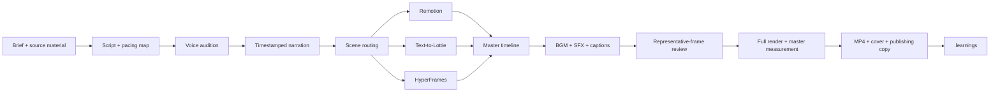

# Agentic Video Foundry ⚡️

> Turn one creative brief into a short video that is actually ready to publish.

[简体中文](README.zh-CN.md) · **English**

[](#install)
[](LICENSE)
[](#scene-routing)
[](#audio-is-not-an-afterthought)

**Agentic Video Foundry** is an open-source, end-to-end video production Skill for coding agents. It does not declare victory when a script is written or a render command exits successfully. It connects the brief, storyboard, voice, music, sound effects, captions, motion, mix, render, audiovisual review, and editable delivery into one reproducible pipeline.

It is designed for short-form social videos, product launches, explainers, tutorials, data stories, and reusable branded series on TikTok, Reels, Shorts, Douyin, Xiaohongshu, and Bilibili.

## Website

The bilingual pop-art website lives in [`website/`](website/): English is the default at `/`, and Simplified Chinese is available at `/zh/`. It is dependency-free and includes canonical URLs, reciprocal hreflang, Open Graph and Twitter metadata, JSON-LD, `robots.txt`, `sitemap.xml`, and `llms.txt`.

The public deployment is designed for [video.zzh.app](https://video.zzh.app/). Approved showcase media is packaged separately and intentionally remains outside Git history.

## Run it from your coding agent

<table>
  <tr>
    <td align="center"><br><strong>Codex</strong></td>
    <td align="center"><br><strong>Claude Code</strong></td>
    <td align="center"><br><strong>Trae</strong></td>
    <td align="center"><br><strong>Gemini CLI</strong></td>
    <td align="center"><br><strong>Kimi Code</strong></td>
    <td align="center"><br><strong>MiniMax</strong></td>
  </tr>
</table>

These are target agent environments, not partner endorsements. Use the standard global install where supported; otherwise link the Skill into the tool's Skill directory or load it through repository instructions.

## Why Agentic Video Foundry

- **Finished-video ownership**: the endpoint is a watched, heard, and measured publishing file—not an intermediate artifact.
- **Narration-driven timing**: real voice timestamps drive scenes and captions; mechanical speed-up cannot hide an overlong script.
- **Two audio backends**: ElevenLabs and Volcengine can be routed independently for voice, music, and sound effects.
- **Real demos first**: product videos prove capability with real interfaces, commands, and outputs.
- **One master timeline**: Remotion owns the final composition; other tools provide bounded scene or asset routes.
- **Progressive style modules**: the core Skill selects a style and only then loads its material, typography, motion, and failure rules.
- **Audible music**: BGM must survive phone speakers without masking the narration.
- **Reproducible and auditable**: fixed dependencies, asset hashes, secret-free manifests, and deterministic frame animation.
- **Hard quality gates**: representative frames, platform safe areas, captions, full viewing, LUFS, dBTP, and encoding checks.
- **Learning without pollution**: isolated findings enter `.learnings/` first and become durable rules only after repeated validation.

## End-to-end pipeline



## Scene routing

| Capability | Best for | Role inside Foundry |
|---|---|---|
| **Remotion** | Multi-scene React video, data templates, exact voice and caption sync | Default master compositor |
| **Text-to-Lottie** | Logos, icons, process diagrams, KPI motion, transparent vector loops | Optional asset route; validate in Skottie and the final renderer |
| **HyperFrames** | HTML/CSS/GSAP, web assets, dynamic charts, DOM motion | Optional scene or project backend |
| **Remotion Scenes** | Reusable React/TSX motion scenes | Pin and vendor per project; do not present it as an Agent Skill |

The router does not reward technology-stack variety. Every shot is routed by its actual requirement, and one master timeline closes the project.

## Progressive style modules

Style is a contract across material, palette, typography, evidence treatment, motion grammar, transitions, and failure conditions. The core Skill reads the [style router](skills/agentic-video-foundry/references/style-routing.md) first and opens a detailed module only after a route is selected.

Built-in modules include:

- [Flat paper collage stop motion](skills/agentic-video-foundry/references/styles/flat-paper-collage-stop-motion.md): warm paper, rigid cutouts, consistent torn edges and down-right shadows, stepped cadence, and explicit no-morph rules.
- [Comic pop-art motion](skills/agentic-video-foundry/references/styles/comic-pop-art-motion.md): four-color print language, bold outlines, selective halftone, panel storytelling, sharp snap timing, and high-contrast calls to action.

Both modules keep real product demos pixel-readable. Style belongs around the evidence; it does not replace evidence with fictional illustration.

## Audio is not an afterthought

<p>
   <strong>ElevenLabs</strong>
  &nbsp;&nbsp;or&nbsp;&nbsp;
   <strong>Volcengine / OpenSpeech</strong>
</p>

Agentic Video Foundry routes ElevenLabs or Volcengine/OpenSpeech across AI narration, multi-voice audition, background music, and interaction sound effects. Both routes audition candidates from the same script before final generation. Real generated timestamps drive scene duration and captions instead of estimated reading speed. Music prompts specify BPM, instrumentation, emotional arc, and an explicit ending; sound effects reinforce only meaningful beats. The provider plan contains no credentials: secrets are read from Keychain or environment variables and never enter source, logs, or manifests.

Volcengine capabilities can be routed as `cost`, `balanced`, or `quality` rather than enabling every purchased model by default. See [audio provider routing](skills/agentic-video-foundry/references/audio-provider-routing.md) and [Volcengine model routing](skills/agentic-video-foundry/references/volcengine-model-routing.md).

Store credentials interactively after rotating any key that has appeared in a chat:

```bash
~/.agents/skills/agentic-video-foundry/scripts/store-audio-credential.sh volcengine
~/.agents/skills/agentic-video-foundry/scripts/store-audio-credential.sh elevenlabs
```

Any change to voice, BGM, SFX, timing, or gain invalidates previous master measurements. Re-render, re-measure, and listen again on phone speakers.

## Install

Install globally from the ZetaZeroHub repository:

```bash
npx skills add ZetaZeroHub/agentic-video-foundry@agentic-video-foundry -g -y
```

For development from a local clone:

```bash
ln -s "$PWD/skills/agentic-video-foundry" \
  "$HOME/.agents/skills/agentic-video-foundry"
```

If a tool scans only a private skill directory, also link the Skill into `~/.codex/skills/`, `~/.claude/skills/`, `~/.gemini/skills/`, or `~/.trae/skills/` as needed.

Restart the coding agent, then ask:

```text
Use $agentic-video-foundry to turn this brief into a 45-second vertical launch video.
Keep the pacing energetic, make real product evidence the visual hero, and keep the music audible without masking the narration.
```

## Optional capabilities

Agentic Video Foundry does not copy third-party skills into this repository:

- [Text-to-Lottie](https://github.com/diffusionstudio/lottie) — MIT; vector motion assets and Skottie preview.
- [HyperFrames](https://github.com/heygen-com/hyperframes) — Apache-2.0; deterministic HTML/GSAP/Lottie video backend.
- [Remotion Scenes](https://github.com/lifeprompt-team/remotion-scenes) — MIT; a source library vendored per project, not an Agent Skill.

Reviewed baselines and integration boundaries are recorded in [THIRD_PARTY.md](THIRD_PARTY.md).

## Audit a video project

```bash
node "$HOME/.agents/skills/agentic-video-foundry/scripts/audit-video-project.mjs" \
  --project /absolute/path/to/video-project \
  --video /absolute/path/to/final.mp4 \
  --strict
```

The auditor checks common secret leaks, nondeterministic animation, audio manifest hashes, and final media streams. Strict mode treats a missing standard structure, audio manifest, or hashed asset as a failure. It is a delivery gate, not a replacement for watching and listening to the entire master.

## Internal validation baseline

The first internal reference film used a nine-scene Remotion and ElevenLabs pipeline at 1080×1920, 30 fps, H.264, and 48 kHz AAC. Voice, BGM, SFX, character-level captions, representative frames, and the final master were generated and checked. Paid assets and the source project are not redistributed; the verification scope and hashes are documented in the [case study](skills/agentic-video-foundry/references/case-study.md).

## Repository layout

```text
agentic-video-foundry/
├── README.md
├── README.zh-CN.md
├── AGENTS.md
├── THIRD_PARTY.md
├── website/
└── skills/
    └── agentic-video-foundry/
        ├── SKILL.md
        ├── agents/openai.yaml
        ├── references/
        └── scripts/{audit-video-project,audio-provider}.mjs
```

## License

Original Agentic Video Foundry content is released under the [MIT License](LICENSE). Third-party frameworks, skills, scene components, and generated media retain their own licenses; this repository documents integration boundaries and does not relicense third-party work.
